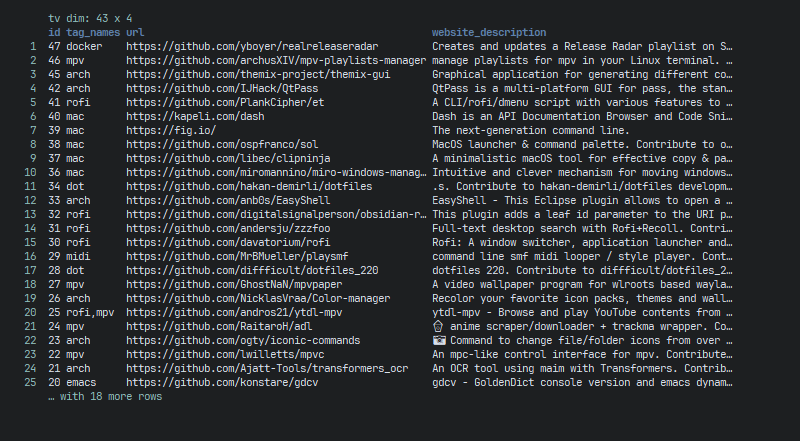
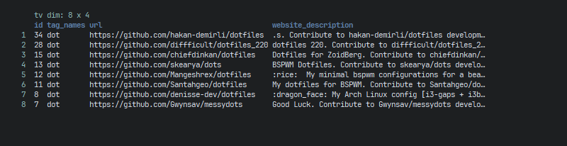

## Host linkding on Windows10

### Install requirements

```sh
scoop install python310 fnm mprocs
fnm install 18.15.0
fnm use 18.15.0
```

```sh
git clone https://github.com/sissbruecker/linkding
```

### Start

```sh
cd linkding
npm install
npm run build
```

```sh
python310 -m venv venv
venv\Scripts\activate.bat
python -m pip install -r requirements.txt
python -m pip install -r requirements.prod.txt
pip install -r requirements.txt
python manage.py migrate
python manage.py createsuperuser --username=YourName --email=your@email.com
```

Test it:

```sh
npm run dev
```

Create a new command-line window:

```sh
python manage.py runserver 8002
```

Open `localhost:8002`.

Finally, create `srv_linkding.cmd`:

```sh
cd ...\linkding ^
	&& set LD_SUPERUSER_NAME=YourName ^
	&& set LD_SUPERUSER_PASSWORD=YourPassword ^
	&& mprocs ^
	"npm run dev" ^
	"timeout 5 && .\venv\Scripts\python.exe manage.py runserver 8002"
```

### Autorun at startup

Add `srv_linkding.vbs`:

```
Set WshShell = CreateObject("WScript.Shell")
  WshShell.Run chr(34) & "...\srv_linkding.cmd" & Chr(34), 0
Set WshShell = Nothing
```

Create shortcut of `.vbs`. Put the `.lnk` into `C:\Users\YourName\AppData\Roaming\Microsoft\Windows\Start Menu\Programs\Startup\`.

## Browser Extension

1. Install the [linkding extension](https://github.com/sissbruecker/linkding-extension)
2. `127.0.0.1:8002` → Settings → Integrations → Integrations → REST API → Copy this
3. linkding extension → Configuration
	- Base URL `http://127.0.0.1:8002`
	- API Authentication Token `YourAPI``

You can also install [linkding injector](https://github.com/fivefold/linkding-injector).

## Witchcraft 🧙

```sh
python310 -m pip install linkding-cli ruamel_yaml
pnpm install ramda-cli
cargo install xsv
scoop install jq
```

Get `tidy-viewer.exe` from https://github.com/alexhallam/tv/releases.

Create a `ding.cmd`:

```sh
linkding.exe --url "http://127.0.0.1:8002" --token "YourAPI" bookmarks all -q %* ^
	| jq ".results[]" ^
	| ramda -c -o csv ^
	| xsv select tag_names,url,website_title ^
	| tidy-viewer -u 45
```

List all bookmarks:

```sh
ding .
```



Search bookmark:

```sh
ding Something
```



## Reference

- [Development](https://github.com/sissbruecker/linkding#development)

## Troubleshoot

- [ModuleNotFoundError: No module named 'ruamel'](https://github.com/fair-workflows/nanopub/issues/106)

## Host linkding on Ubuntu 22.04.4 ARM

↪ https://github.com/sissbruecker/linkding/blob/master/README.md#setup

```sh
vim requirements.dev.txt
```

```
rcssmin==1.1.1
```

To:

```
rcssmin
```

```sh
npm install -g concurrently
```

```sh
vim package.json
```

```sh
{
	...
  "scripts": {
  	"start": "concurrently \"rollup -c -w\" \"python manage.py runserver 0.0.0.0:8060\"",
  	...
```

```sh
pm2 start npm --name "linkding" -- run start
pm2 save
```