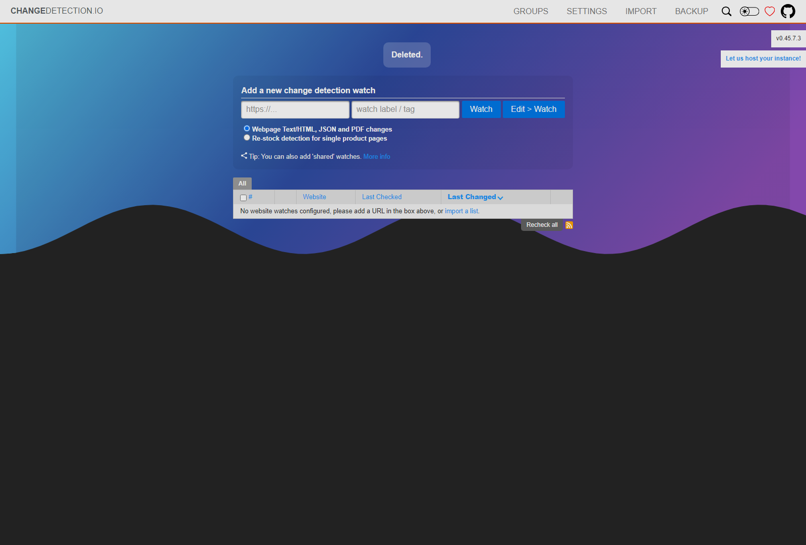
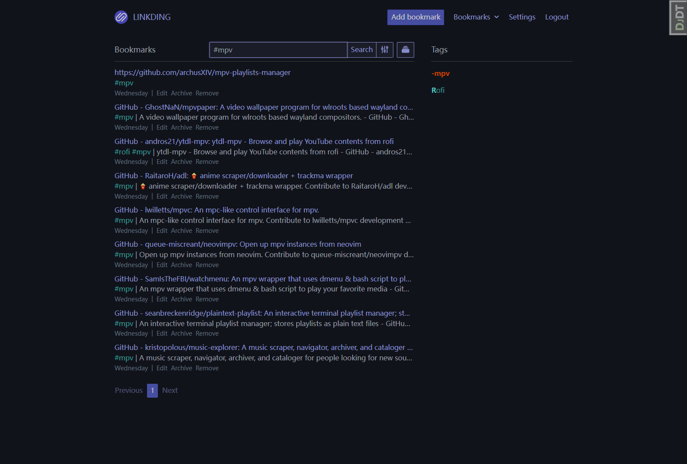
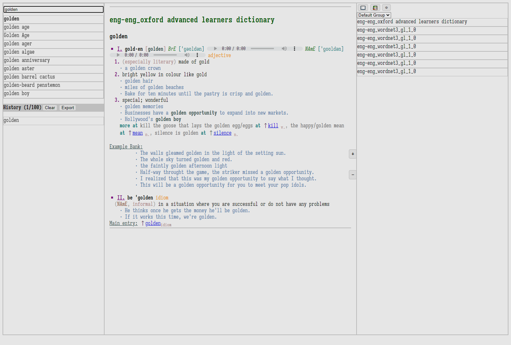
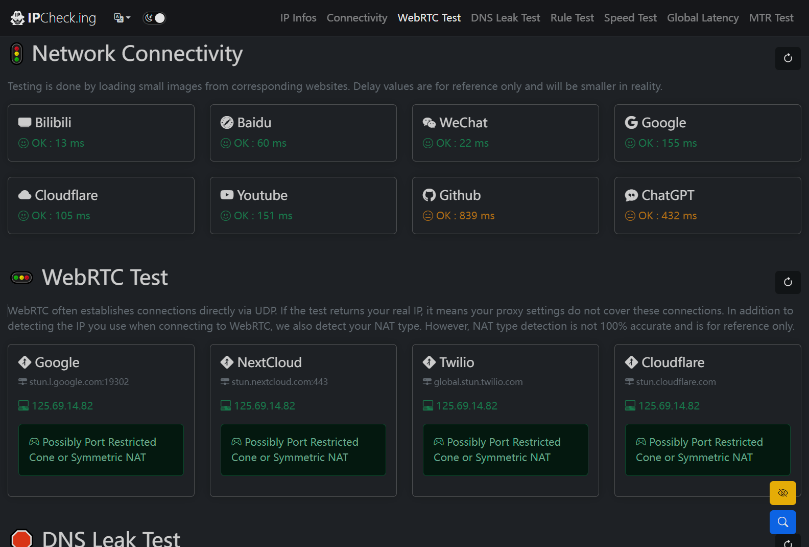

group | source | license | readme | preview
:- | :- | :- | :- | :-:
watch | [CHANGE DETECTION](//github.com/dgtlmoon/changedetection.io) |  |  | [.md](_readme/changedetection.md) | 
rss | [miniflux](//github.com/miniflux/v2) |  | [.md](_readme/miniflux.md) | 
bookmark | [linkding](//github.com/sissbruecker/linkding) |  | [.md](_readme/linkding.md) | 
dict | [SilverDict](//github.com/Crissium/SilverDict) |  |  | [.md](_readme/SilverDict.md) | 
tool | [MyIP](//github.com/jason5ng32/MyIP) |  |  | [.md](_readme/myip.md) | 